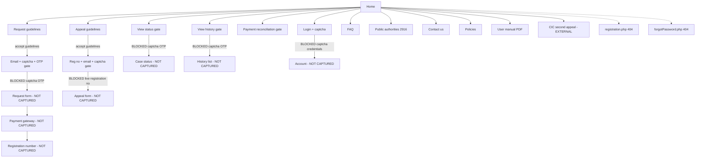

# Citizen flows on RTI Online

Edges are `screen -> action -> next screen`. BLOCKED means this audit stopped on purpose.

## Recorded edges

| From | Action | To |
| --- | --- | --- |
| home | Open primary navigation destinations | nav-targets |
| guidelines-request | Submit without checkbox | alert: Please select the undertaking statement! |
| guidelines-request | Accept guidelines and Submit | request-email-otp-gate |
| request-email-otp-gate | Email + captcha + OTP (BLOCKED) | request-form-not-captured |
| guidelines-appeal | Submit without checkbox | alert: Please select the undertaking statement! (`first-appeal.guidelines.unchecked`) |
| guidelines-appeal | Accept guidelines and Submit | appeal-lookup-gate |
| appeal-lookup-gate | Registration no + email + captcha (BLOCKED) | appeal-form-not-captured |
| login | Submit empty form | client-validation |
| login | Username + password + captcha (BLOCKED) | account-not-captured |
| view-status | Submit empty form | client-validation |
| view-status | Reg no + email + captcha + OTP (BLOCKED) | case-status-not-captured |
| view-history | Email + mobile + captcha + OTP (BLOCKED) | history-list-not-captured |
| payment-reconciliation | Email + captcha (BLOCKED) | payment-result-not-captured |
| faq | Expand each accordion (+) | faq-answer-visible |
| home | Public Authorities Available | allpa-directory |
| allpa-directory | Expand ministry (+) | nested-public-authorities |

