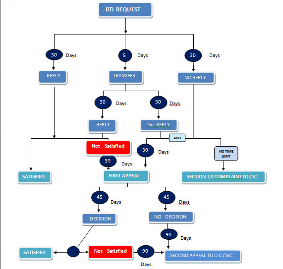
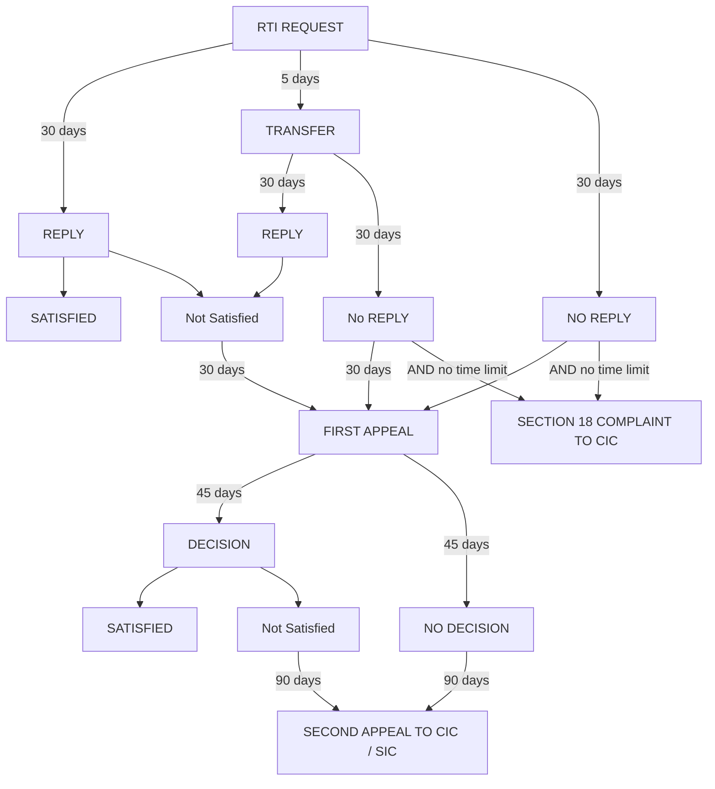

# Official lifecycle diagram (homepage)

**Label:** VERIFIED_LIVE (image on https://rtionline.gov.in/)  
**Screenshot:** `screenshots/desktop/home.lifecycle.png`  
**Asset URL:** `https://rtionline.gov.in/images/rti_lifecycle.jpg`

These nodes are **process outcomes drawn on the homepage**, not separate URLs. Do not treat them as captured form screens. Form/OTP/payment states remain DOCUMENTED_ONLY until human-assisted capture.

## Graph (as drawn)

## Statutory times shown on the diagram

| Edge | Days shown | Meaning on the official graphic |
| --- | --- | --- |
| Request → Reply | 30 | Usual reply clock |
| Request → Transfer | 5 | Transfer to another public authority |
| After transfer → Reply / No reply | 30 | Clock at the receiving authority |
| Request → No reply | 30 | Silence |
| Not satisfied / no reply → First appeal | 30 | Time to file first appeal (as drawn) |
| No reply **and** no time limit | — | Section 18 complaint to CIC (parallel, not instead of, first appeal) |
| First appeal → Decision / no decision | 45 | First appellate authority |
| Not satisfied or no decision → Second appeal CIC/SIC | 90 | |

The diagram does **not** show the 48-hour life-or-liberty clock. That clock is in the Act and in this prototype; it is not a homepage control.

## Related live screens

- First appeal **filing** starts at `first-appeal.guidelines` (VERIFIED_LIVE), then captcha lookup.
- Second appeal is **external**: CIC portal, not a page on rtionline.gov.in.
- Section 18 complaint is the same external CIC path.
