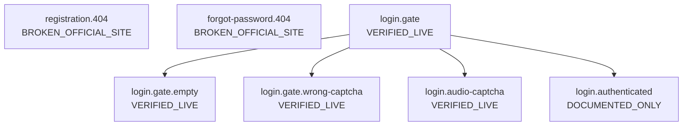
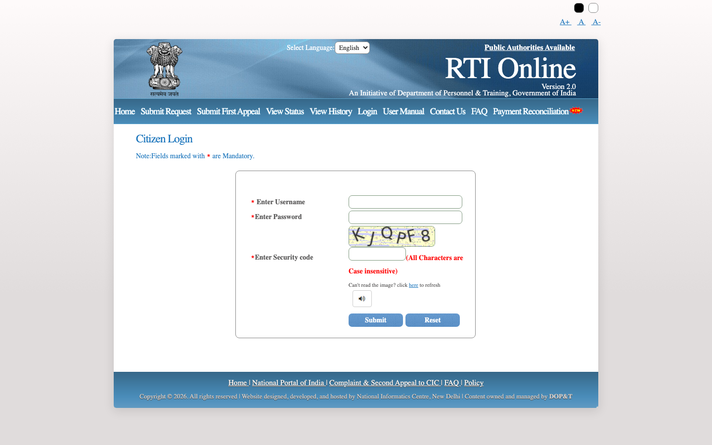
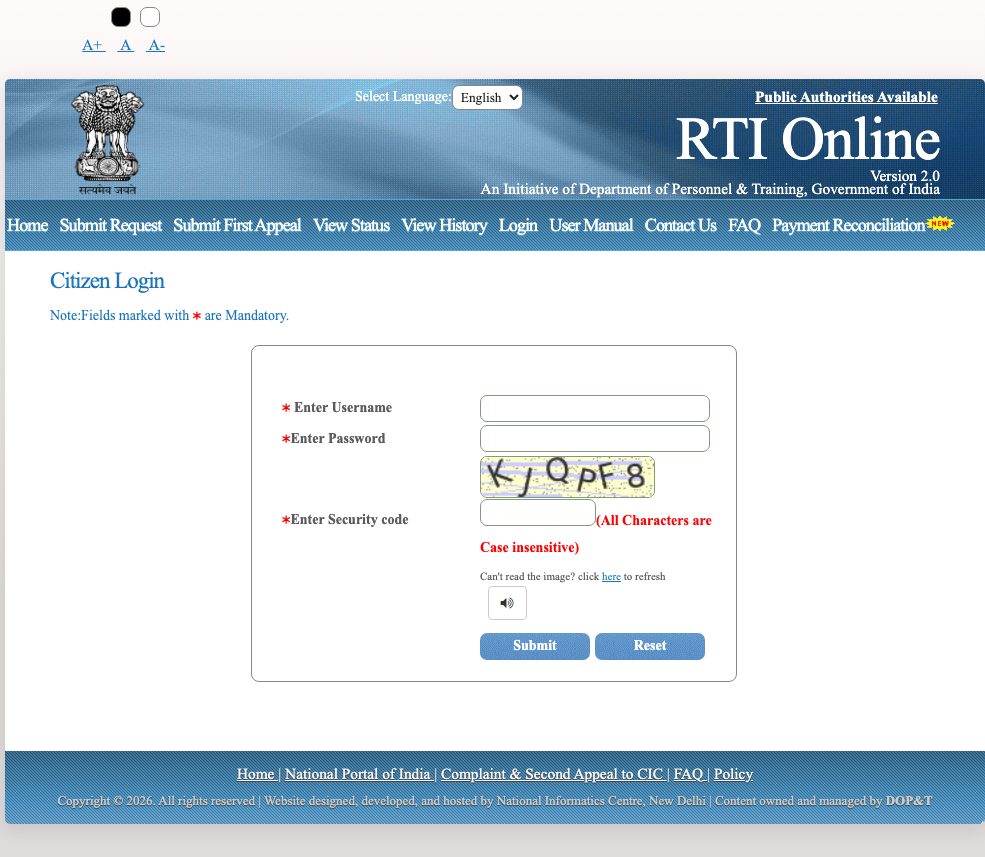
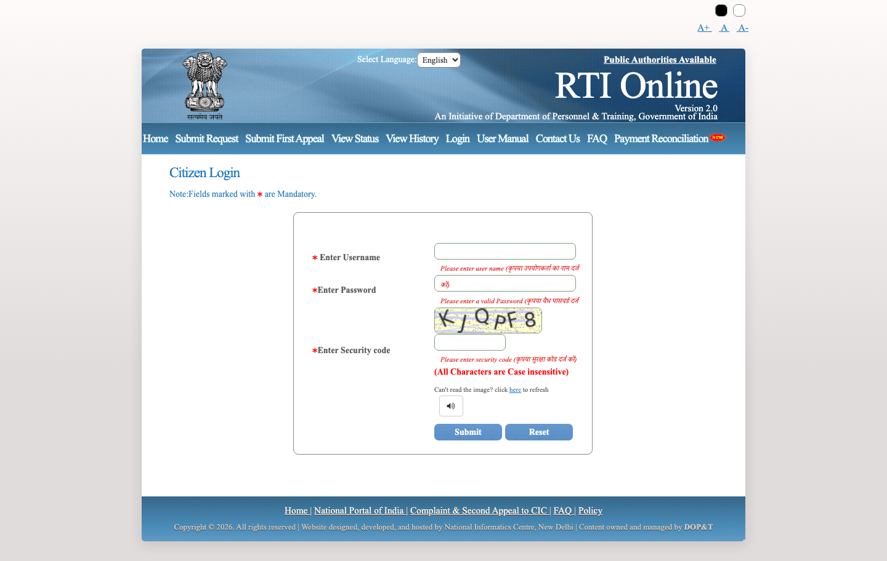
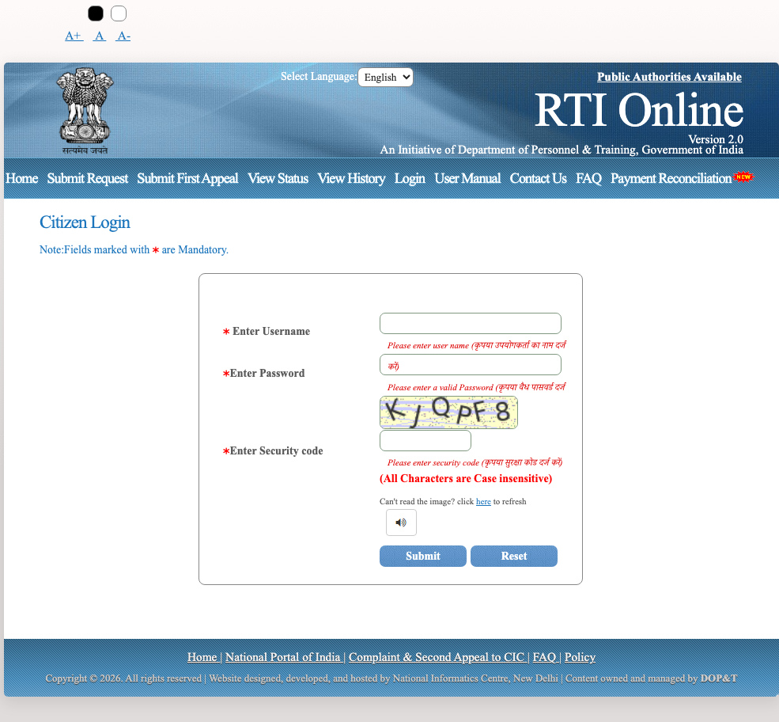
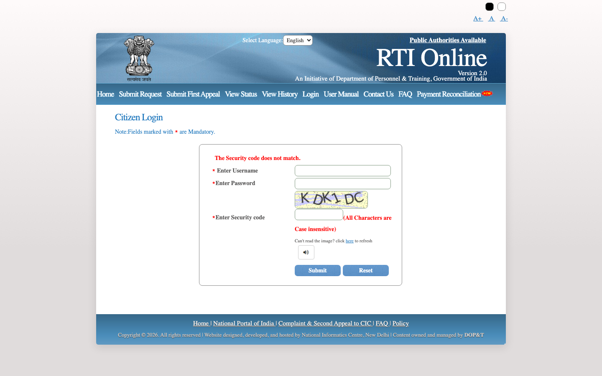
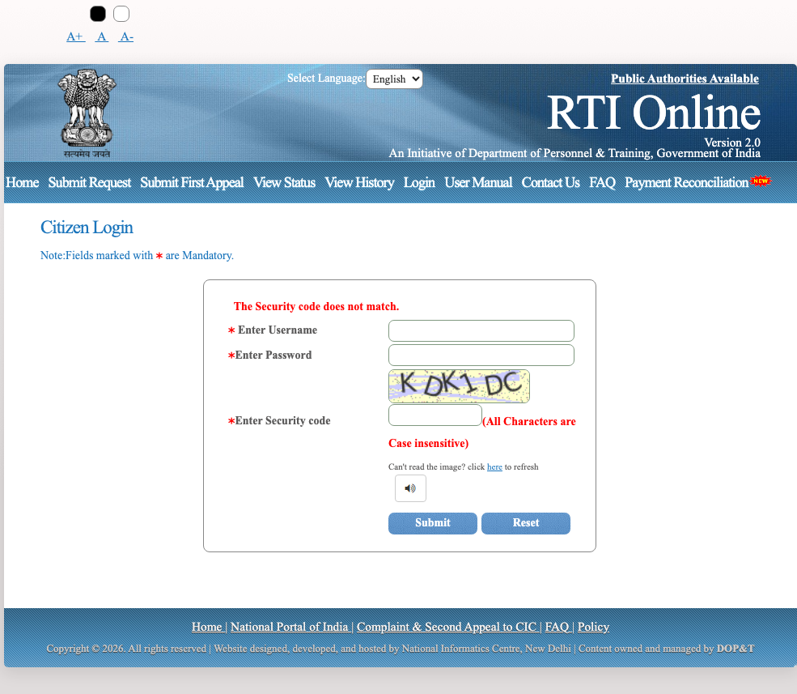

# Flow: login

| ID | Label | URL | Action in | Next | Validation observed | Screenshot |
| --- | --- | --- | --- | --- | --- | --- |
| `registration.404` | BROKEN_OFFICIAL_SITE | https://rtionline.gov.in/registration.php | GET /registration.php |  | — | `screenshots/desktop/registration.404.png` |
| `forgot-password.404` | BROKEN_OFFICIAL_SITE | https://rtionline.gov.in/forgotPassword.php | GET /forgotPassword.php |  | — | `screenshots/desktop/forgot-password.404.png` |
| `login.gate` | VERIFIED_LIVE | https://rtionline.gov.in/login.php | Home → Login | Submit; Reset; Public Authorities Available; Home; Submit Request; Submit First Appeal; View Status; View History; Login; User Manual | — | `screenshots/desktop/login.gate.png` |
| `login.gate.empty` | VERIFIED_LIVE | https://rtionline.gov.in/login.php | Submit empty login | Submit; Reset; Public Authorities Available; Home; Submit Request; Submit First Appeal; View Status; View History; Login; User Manual | Please enter user name (कृपया उपयोगकर्ता का नाम दर्ज करें); Please enter a valid Password (कृपया वैध पासवर्ड दर्ज करें); Please enter security code (कृपया सुरक्षा कोड दर्ज करें) | `screenshots/desktop/login.gate.empty.png` |
| `login.gate.wrong-captcha` | VERIFIED_LIVE | https://rtionline.gov.in/login.php?error=dW9UY0U0UktRYkJzRTh3bkdmanFWcXZTVzM2eGt1a25URTRkZVZnT2dqVFpWYS9HeWpPU0w5QmZqYjNRQStSYjo6vLXmeBNUsLxrHveP2kimlg%3D%3D | Invalid username + wrong captcha (single attempt, not brute-force) | Submit; Reset; Public Authorities Available; Home; Submit Request; Submit First Appeal; View Status; View History; Login; User Manual | The Security code does not match. | `screenshots/desktop/login.gate.wrong-captcha.png` |
| `login.audio-captcha` | VERIFIED_LIVE | https://rtionline.gov.in/audiofile1.php | Open audio captcha popup |  | — | `screenshots/desktop/login.audio-captcha.png` |
| `login.authenticated` | DOCUMENTED_ONLY | — | Valid username + password + captcha | History; Saved drafts (if any) | — | — |

## registration.404

## forgot-password.404

## login.gate

## login.gate.empty

Validation observed: Please enter user name (कृपया उपयोगकर्ता का नाम दर्ज करें); Please enter a valid Password (कृपया वैध पासवर्ड दर्ज करें); Please enter security code (कृपया सुरक्षा कोड दर्ज करें)

## login.gate.wrong-captcha

Validation observed: The Security code does not match.

## login.audio-captcha

WAV at /audio/en/.wav 404s (SiteOne). Popup may render captcha glyphs as visible text. Glyphs are not recorded and are never used to pass a gate.

