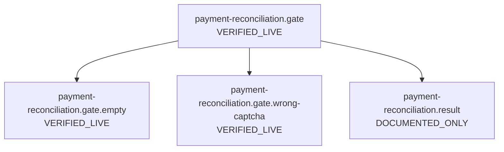
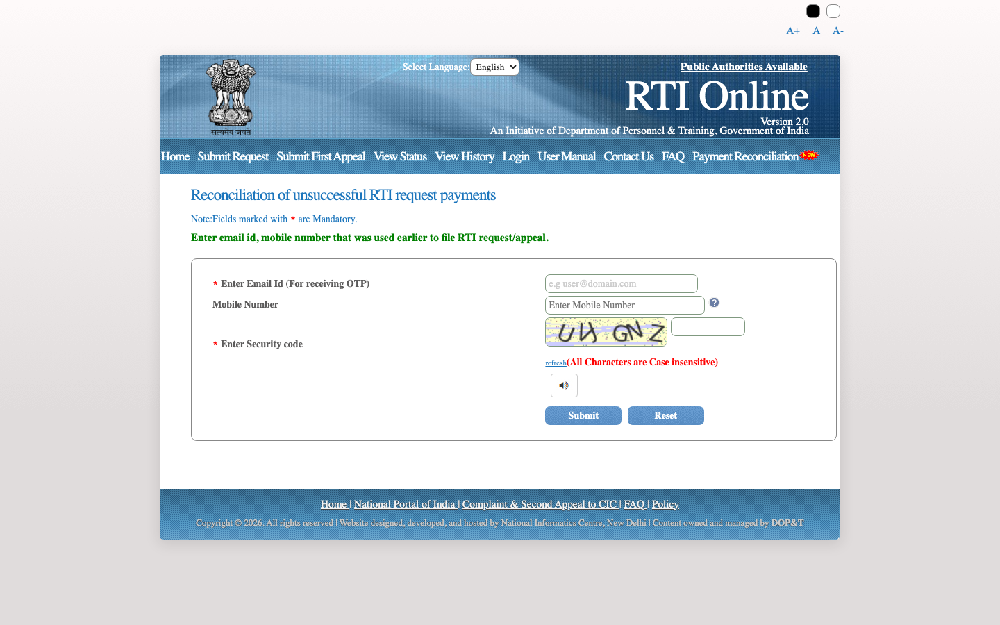
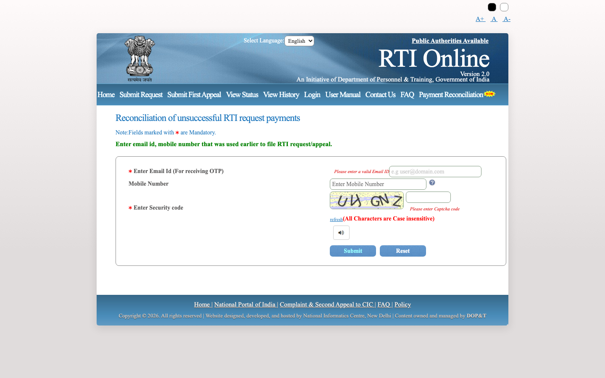
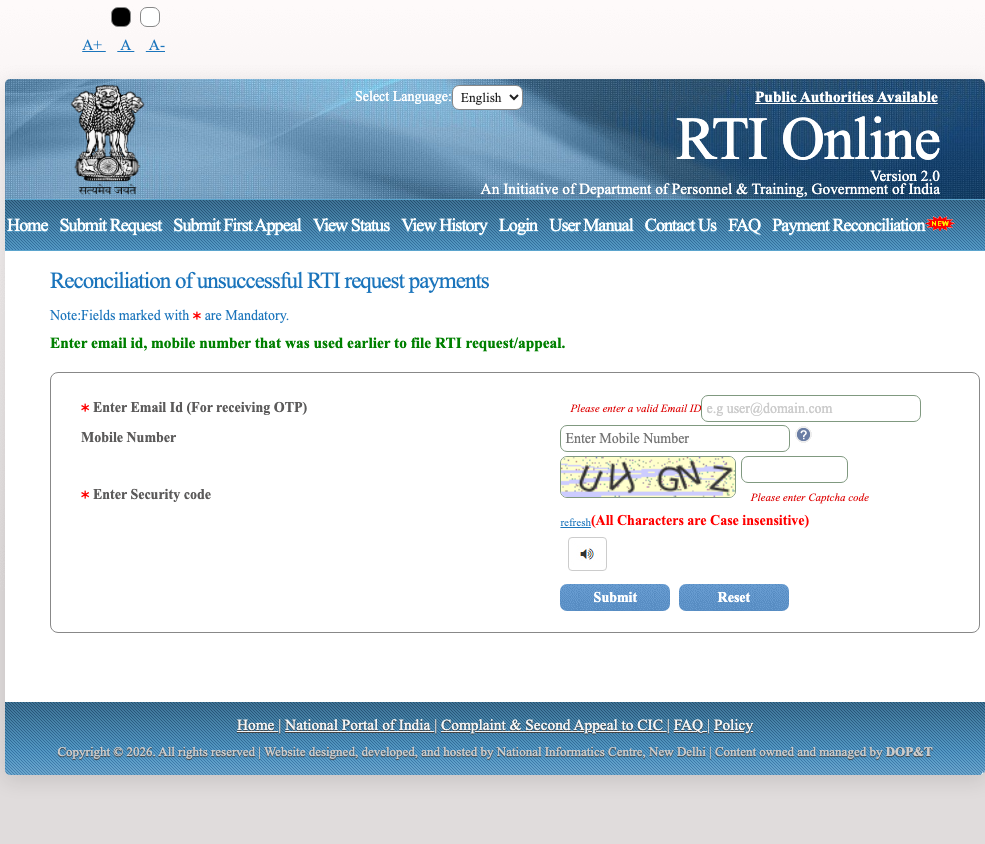
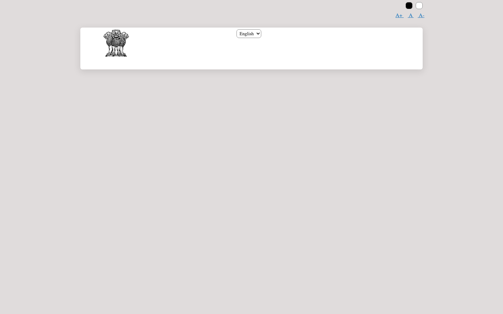
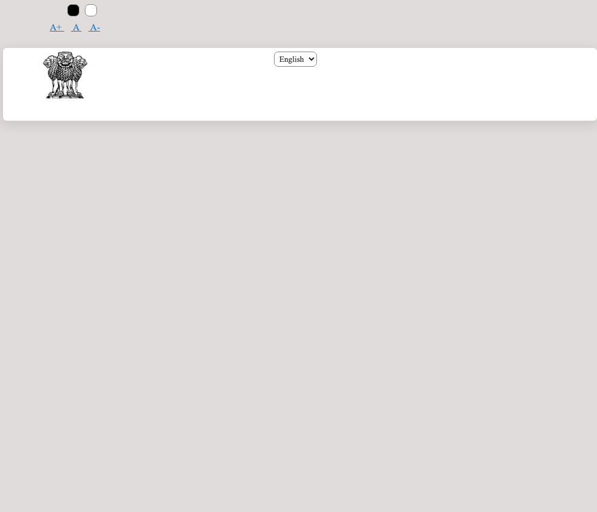

# Flow: payment-reconciliation

| ID | Label | URL | Action in | Next | Validation observed | Screenshot |
| --- | --- | --- | --- | --- | --- | --- |
| `payment-reconciliation.gate` | VERIFIED_LIVE | https://rtionline.gov.in/request/status_pendingPayment.php | Home → Payment Reconciliation | Submit; Reset; Public Authorities Available; Home; Submit Request; Submit First Appeal; View Status; View History; Login; User Manual | — | `screenshots/desktop/payment-reconciliation.gate.png` |
| `payment-reconciliation.gate.empty` | VERIFIED_LIVE | https://rtionline.gov.in/request/status_pendingPayment.php | Submit empty reconciliation form | Submit; Reset; Public Authorities Available; Home; Submit Request; Submit First Appeal; View Status; View History; Login; User Manual | Please enter a valid Email ID; Please enter Captcha code | `screenshots/desktop/payment-reconciliation.gate.empty.png` |
| `payment-reconciliation.gate.wrong-captcha` | VERIFIED_LIVE | https://rtionline.gov.in/request/status_pendingPayment.php | Dummy email + empty mobile + wrong captcha ZZZZZZ | Public Authorities Available | — | `screenshots/desktop/payment-reconciliation.gate.wrong-captcha.png` |
| `payment-reconciliation.result` | DOCUMENTED_ONLY | — | Valid email + captcha (and likely OTP) | Open View Status if number exists; Wait 24–48 working hours; Mail help desk | — | — |

## payment-reconciliation.gate

## payment-reconciliation.gate.empty

Validation observed: Please enter a valid Email ID; Please enter Captcha code

## payment-reconciliation.gate.wrong-captcha

Live probe: form vanished after wrong-captcha POST. Not an OTP/result screen. Official page rendered masthead + language select only.

