# Flow: shell

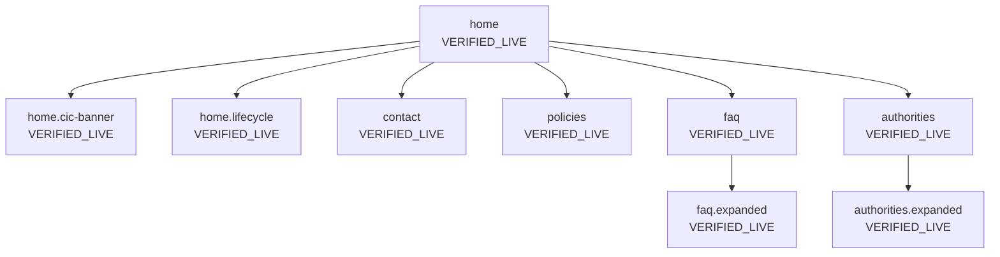

| ID | Label | URL | Action in | Next | Screenshot |
| --- | --- | --- | --- | --- | --- |
| `home` | VERIFIED_LIVE | https://rtionline.gov.in/ | Open https://rtionline.gov.in/ | Submit Request; Submit First Appeal; View Status; View History; Login; Payment Reconciliation; FAQ; Contact Us; Policy; Public Authorities Available | `screenshots/desktop/home.png` |
| `home.cic-banner` | VERIFIED_LIVE | https://rtionline.gov.in/ | Land on home | Complaint & Second Appeal to CIC | `screenshots/desktop/home.png` |
| `home.lifecycle` | VERIFIED_LIVE | https://rtionline.gov.in/images/rti_lifecycle.jpg | Homepage diagram | Submit Request; First Appeal; CIC | `screenshots/desktop/home.lifecycle.png` |
| `contact` | VERIFIED_LIVE | https://rtionline.gov.in/Contactus.php | Navigate /Contactus.php | Public Authorities Available; Home; Submit Request; Submit First Appeal; View Status; View History; Login; User Manual | `screenshots/desktop/contact.png` |
| `policies` | VERIFIED_LIVE | https://rtionline.gov.in/Policies.php | Navigate /Policies.php | Public Authorities Available; Home; Submit Request; Submit First Appeal; View Status; View History; Login; User Manual | `screenshots/desktop/policies.png` |
| `faq` | VERIFIED_LIVE | https://rtionline.gov.in/faq.php | Navigate /faq.php | +; Public Authorities Available; Home; Submit Request; Submit First Appeal; View Status; View History; Login; User Manual | `screenshots/desktop/faq.png` |
| `authorities` | VERIFIED_LIVE | https://rtionline.gov.in/request/allpa.php | Navigate /request/allpa.php | Back | `screenshots/desktop/authorities.png` |
| `faq.expanded` | VERIFIED_LIVE | https://rtionline.gov.in/faq.php | Expand every FAQ accordion | -; Public Authorities Available; Home; Submit Request; Submit First Appeal; View Status; View History; Login; User Manual | `screenshots/desktop/faq.expanded.png` |
| `authorities.expanded` | VERIFIED_LIVE | https://rtionline.gov.in/request/allpa.php | Expand first three ministry rows | Back | `screenshots/desktop/authorities.expanded.png` |

## home

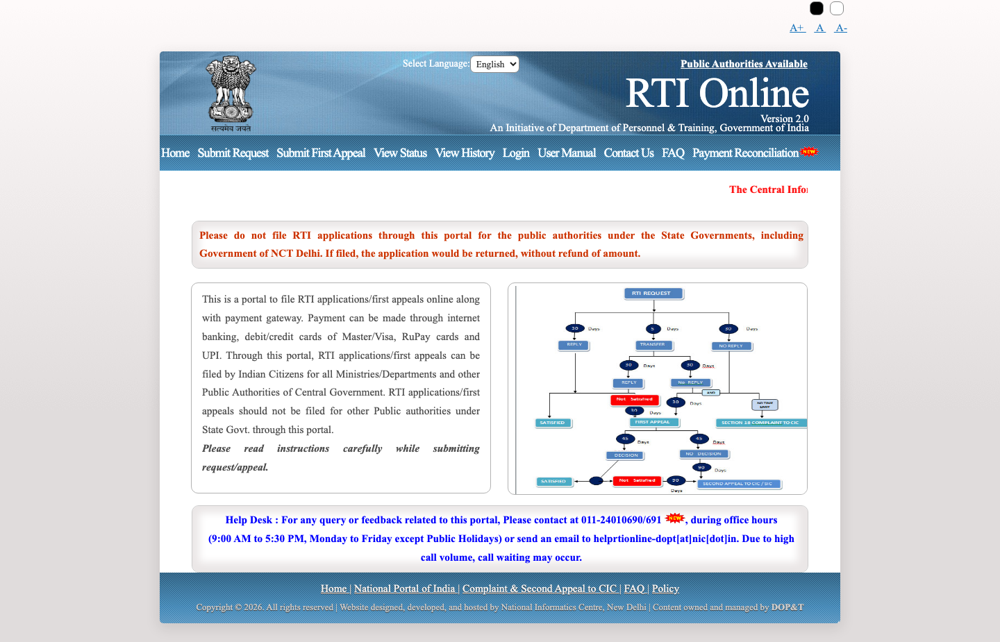
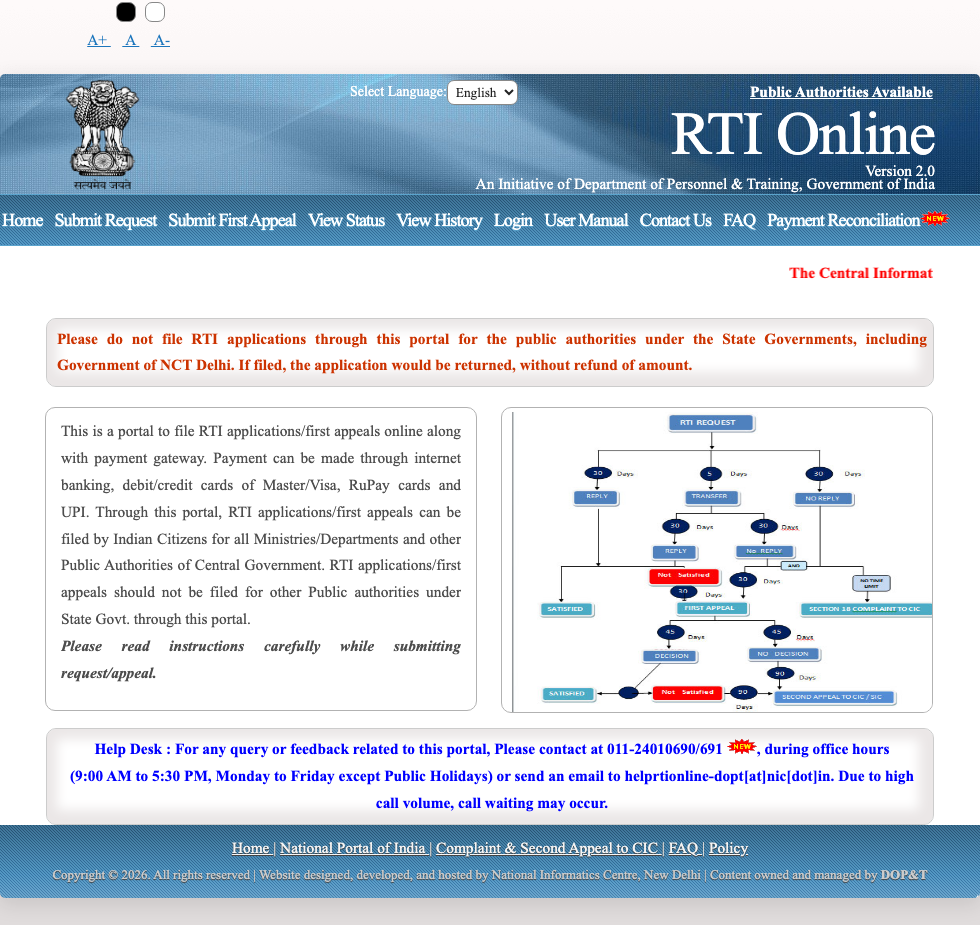

## home.lifecycle

Full homepage copy: [pages/home.md](../pages/home.md). Statutory graph: [lifecycle.md](lifecycle.md).

## contact

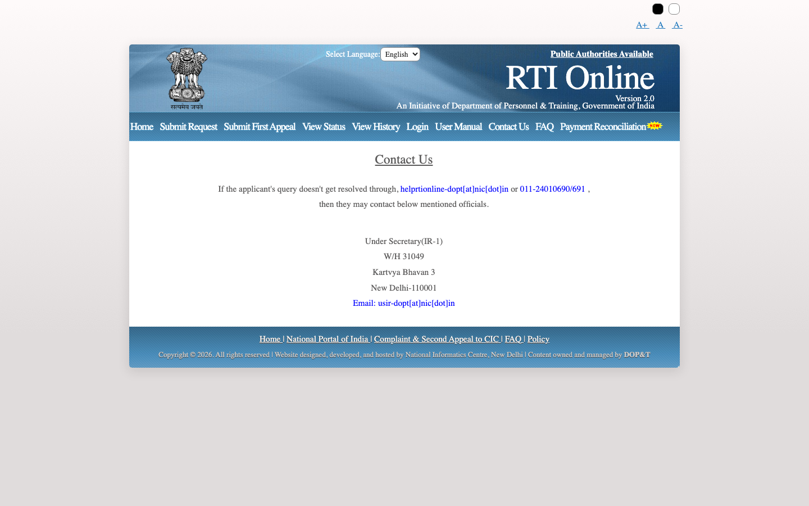
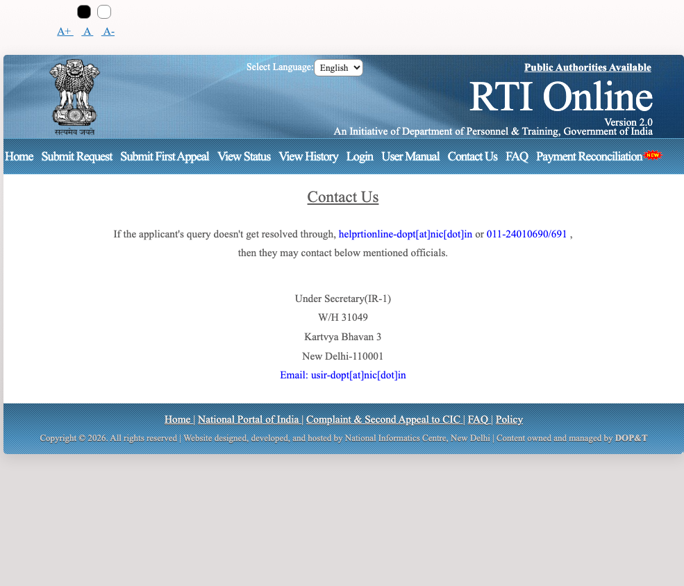

## policies

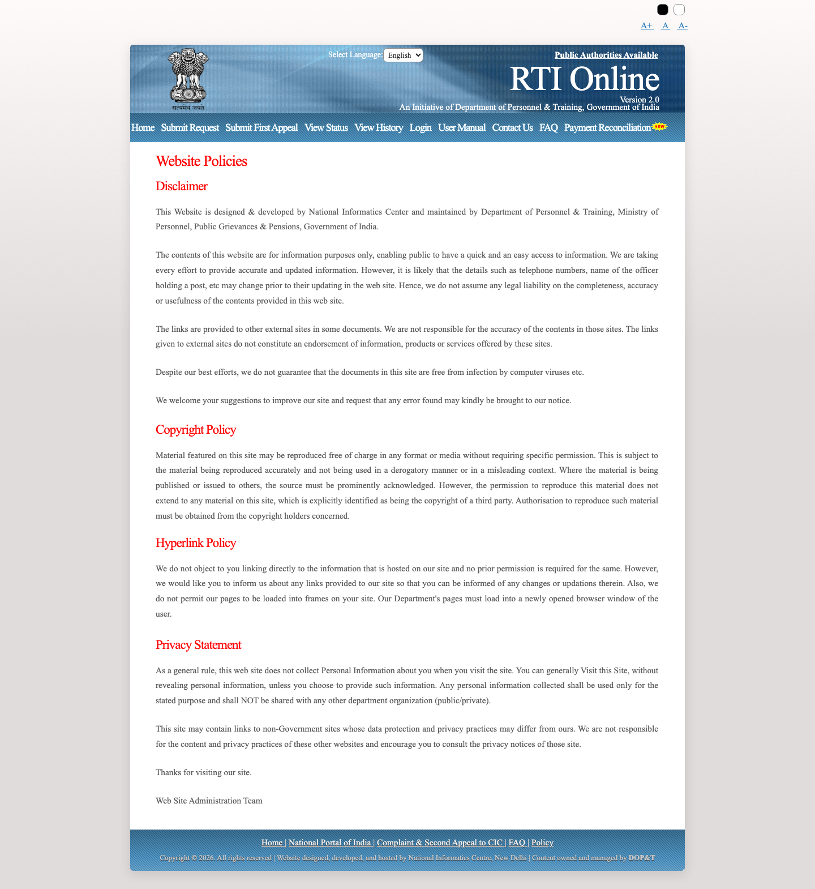
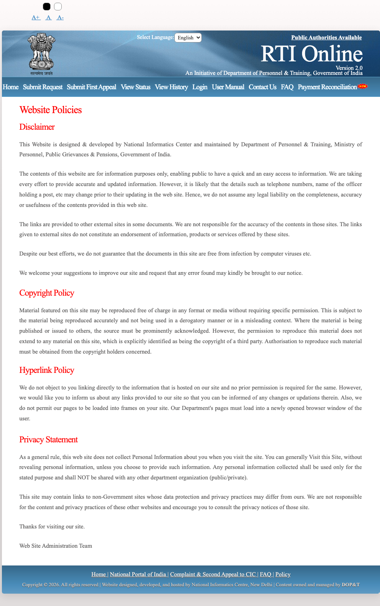

## faq

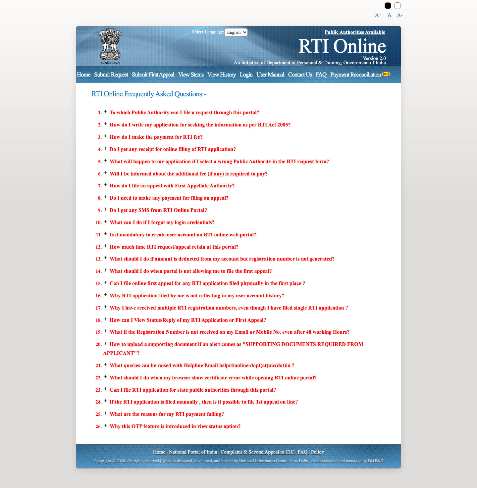
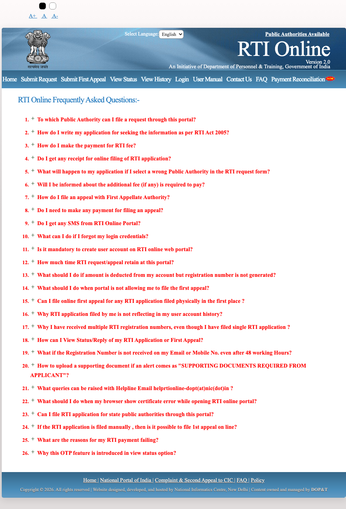

## authorities

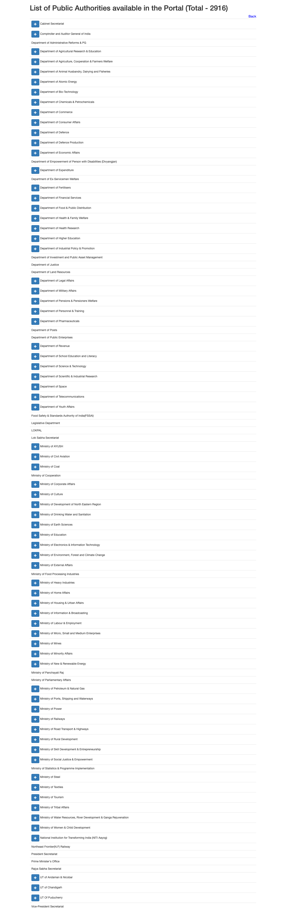
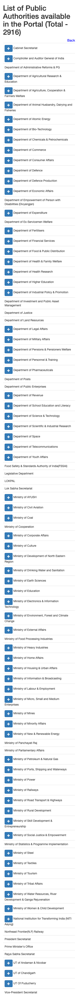

## faq.expanded

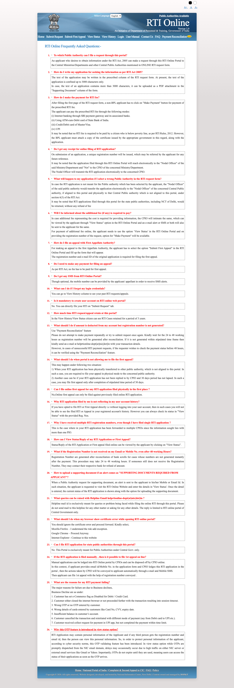
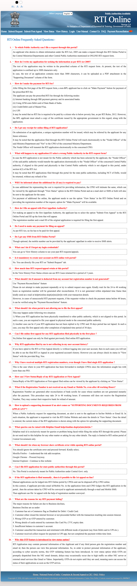

## authorities.expanded

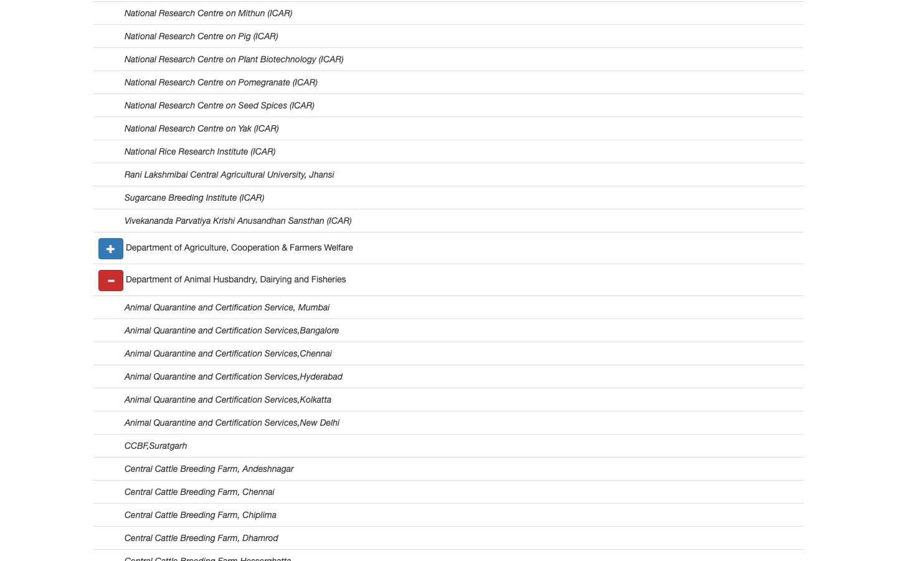
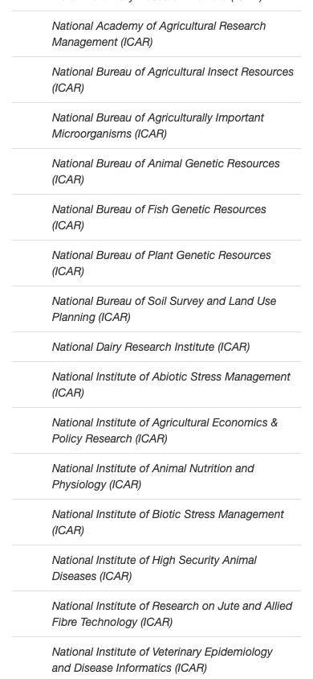

