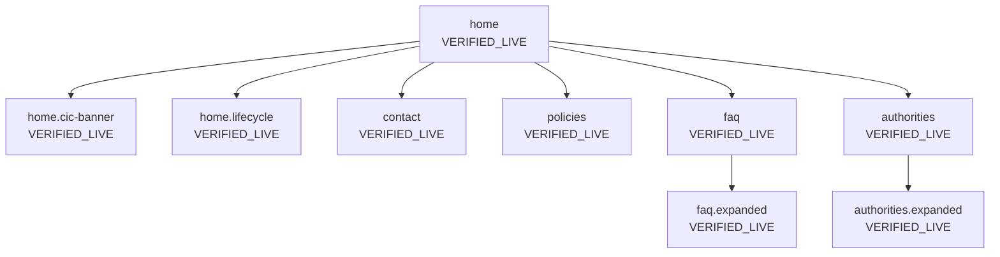
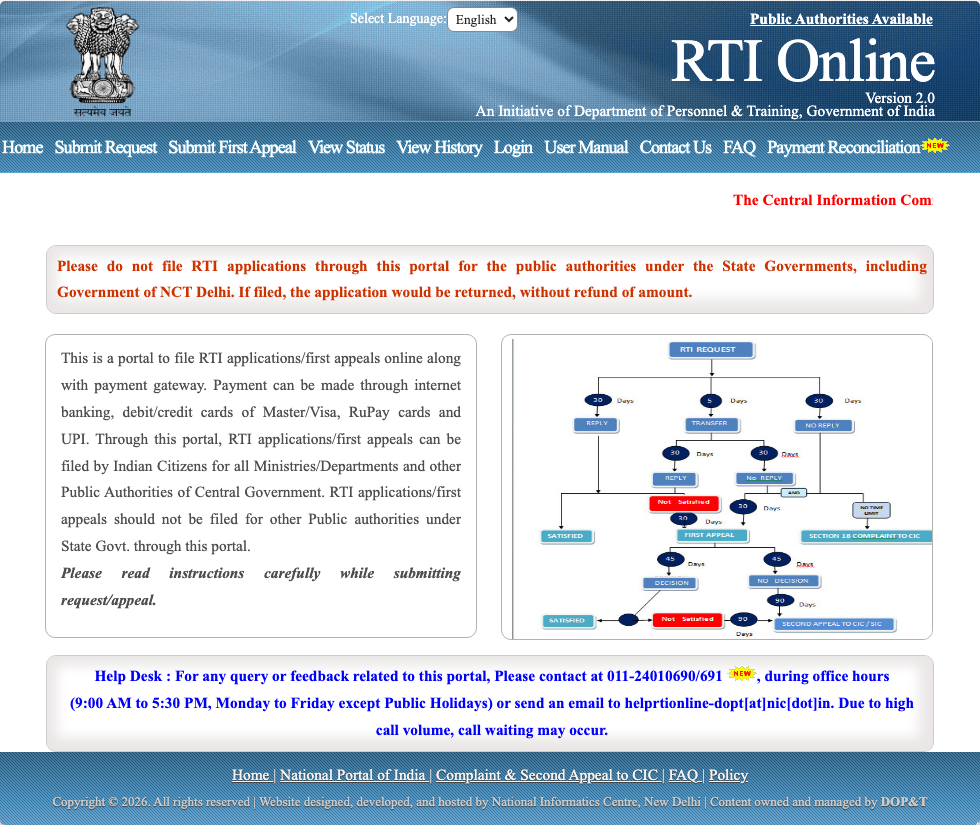
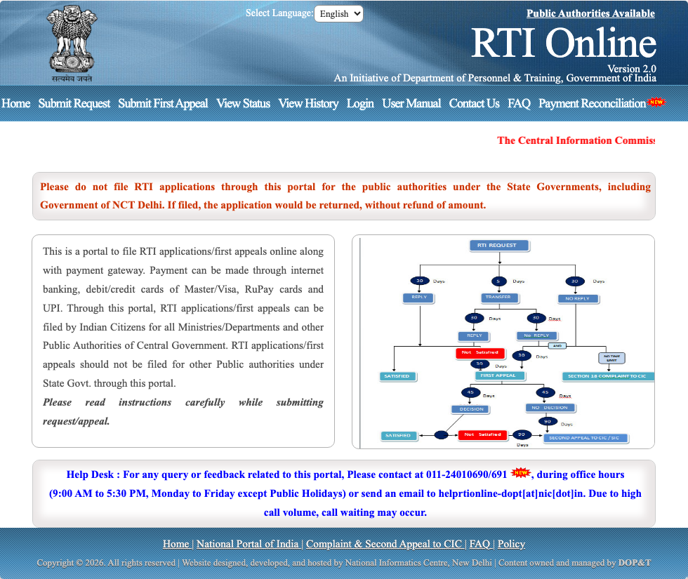
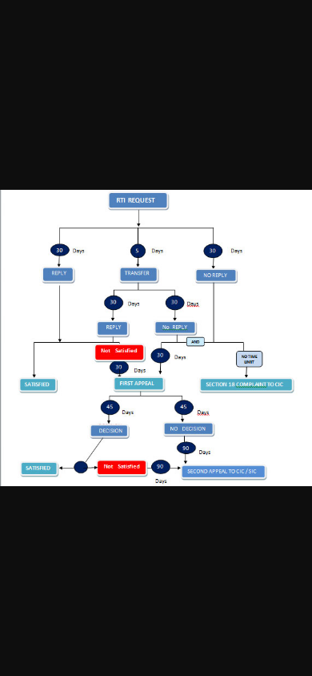

# Flow: shell

| ID | Label | URL | Action in | Next | Validation observed | Screenshot |
| --- | --- | --- | --- | --- | --- | --- |
| `home` | VERIFIED_LIVE | https://rtionline.gov.in/ | Open https://rtionline.gov.in/ | Submit Request; Submit First Appeal; View Status; View History; Login; Payment Reconciliation; FAQ; Contact Us; Policy; Public Authorities Available | — | `screenshots/desktop/home.png` |
| `home.cic-banner` | VERIFIED_LIVE | https://rtionline.gov.in/ | Land on home (CIC integration notice) | Complaint & Second Appeal to CIC (external dsscic.nic.in); Submit First Appeal | alert: The Central Information Commission (CIC) has integrated its Second Appeal Filing Portal with the Department of Personnel and Training (DoPT) RTI Online Portal. Now, while submitting a Second Appeal, appellants can input the First Appeal Registration Number, Email ID and Date of Filing the First Appeal, thereafter, the system will automatically retrieve related details of the RTI Application and First Appeal from the RTI Online Portal. This will ensure a smooth and more streamlined Second Appeal filing process. | `screenshots/desktop/home.cic-banner.png` |
| `home.lifecycle` | VERIFIED_LIVE | https://rtionline.gov.in/images/rti_lifecycle.jpg | Homepage embeds images/rti_lifecycle.jpg (alt image1) | Submit Request; Submit First Appeal; Complaint & Second Appeal to CIC | — | `screenshots/desktop/home.lifecycle.png` |
| `contact` | VERIFIED_LIVE | https://rtionline.gov.in/Contactus.php | Navigate /Contactus.php | Public Authorities Available; Home; Submit Request; Submit First Appeal; View Status; View History; Login; User Manual | — | `screenshots/desktop/contact.png` |
| `policies` | VERIFIED_LIVE | https://rtionline.gov.in/Policies.php | Navigate /Policies.php | Public Authorities Available; Home; Submit Request; Submit First Appeal; View Status; View History; Login; User Manual | — | `screenshots/desktop/policies.png` |
| `faq` | VERIFIED_LIVE | https://rtionline.gov.in/faq.php | Navigate /faq.php | +; Public Authorities Available; Home; Submit Request; Submit First Appeal; View Status; View History; Login; User Manual | — | `screenshots/desktop/faq.png` |
| `authorities` | VERIFIED_LIVE | https://rtionline.gov.in/request/allpa.php | Navigate /request/allpa.php | Back | — | `screenshots/desktop/authorities.png` |
| `faq.expanded` | VERIFIED_LIVE | https://rtionline.gov.in/faq.php | Expand every FAQ accordion | -; Public Authorities Available; Home; Submit Request; Submit First Appeal; View Status; View History; Login; User Manual | — | `screenshots/desktop/faq.expanded.png` |
| `authorities.expanded` | VERIFIED_LIVE | https://rtionline.gov.in/request/allpa.php | Expand first three ministry rows | Back | — | `screenshots/desktop/authorities.expanded.png` |

## home

Playwright 1440×900 home shot can crop the CIC banner. Full banner + lifecycle recorded as home.cic-banner and home.lifecycle.

## home.cic-banner

Validation observed: alert: The Central Information Commission (CIC) has integrated its Second Appeal Filing Portal with the Department of Personnel and Training (DoPT) RTI Online Portal. Now, while submitting a Second Appeal, appellants can input the First Appeal Registration Number, Email ID and Date of Filing the First Appeal, thereafter, the system will automatically retrieve related details of the RTI Application and First Appeal from the RTI Online Portal. This will ensure a smooth and more streamlined Second Appeal filing process.

Full text verified from live homepage HTML. Playwright PNG may still crop overflow (“The C” / “The Centra”). Footer link uses HTTP and a JS alert with the same copy. Banner: The Central Information Commission (CIC) has integrated its Second Appeal Filing Portal with the Department of Personnel and Training (DoPT) RTI Online Portal. Now, while submitting a Second Appeal, appellants can input the First Appeal Registration Number, Email ID and Date of Filing the First Appeal, thereafter, the system will automatically retrieve related details of the RTI Application and First Appeal from the RTI Online Portal. This will ensure a smooth and more streamlined Second Appeal 

## home.lifecycle

Process graphic, not a form. Nodes and day-counts are recorded in flows/lifecycle.md. Trailing-slash URL 404s.

## contact

## policies

## faq

## authorities

## faq.expanded

## authorities.expanded

Full homepage copy: [pages/home.md](../pages/home.md). Statutory graph: [lifecycle.md](lifecycle.md).

