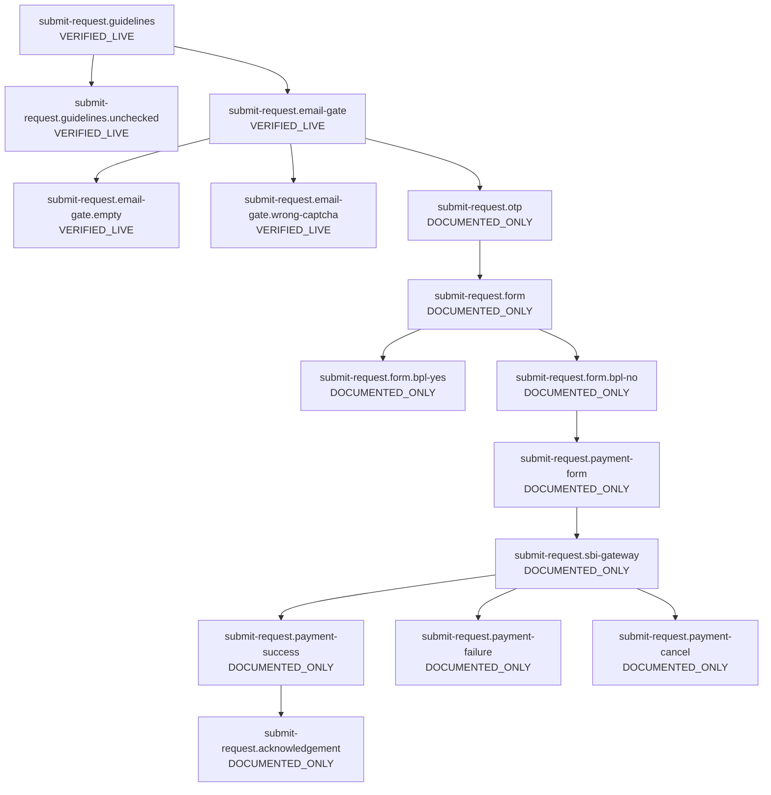
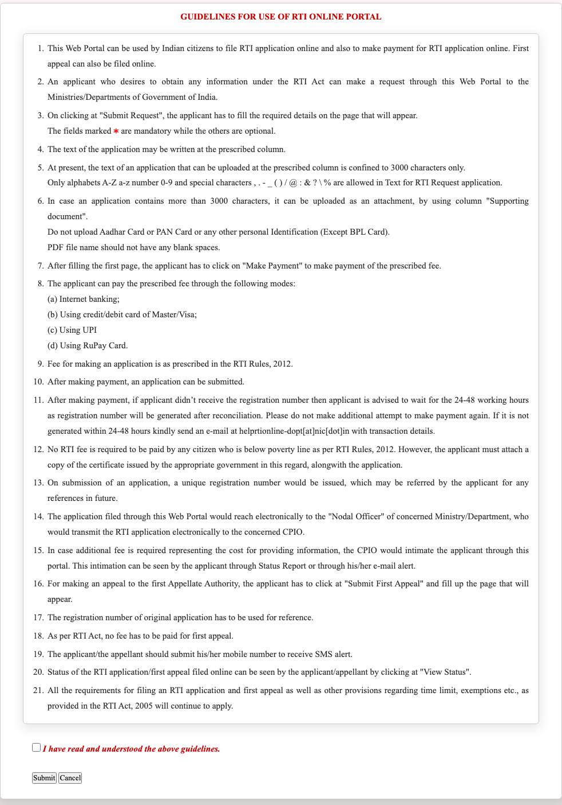
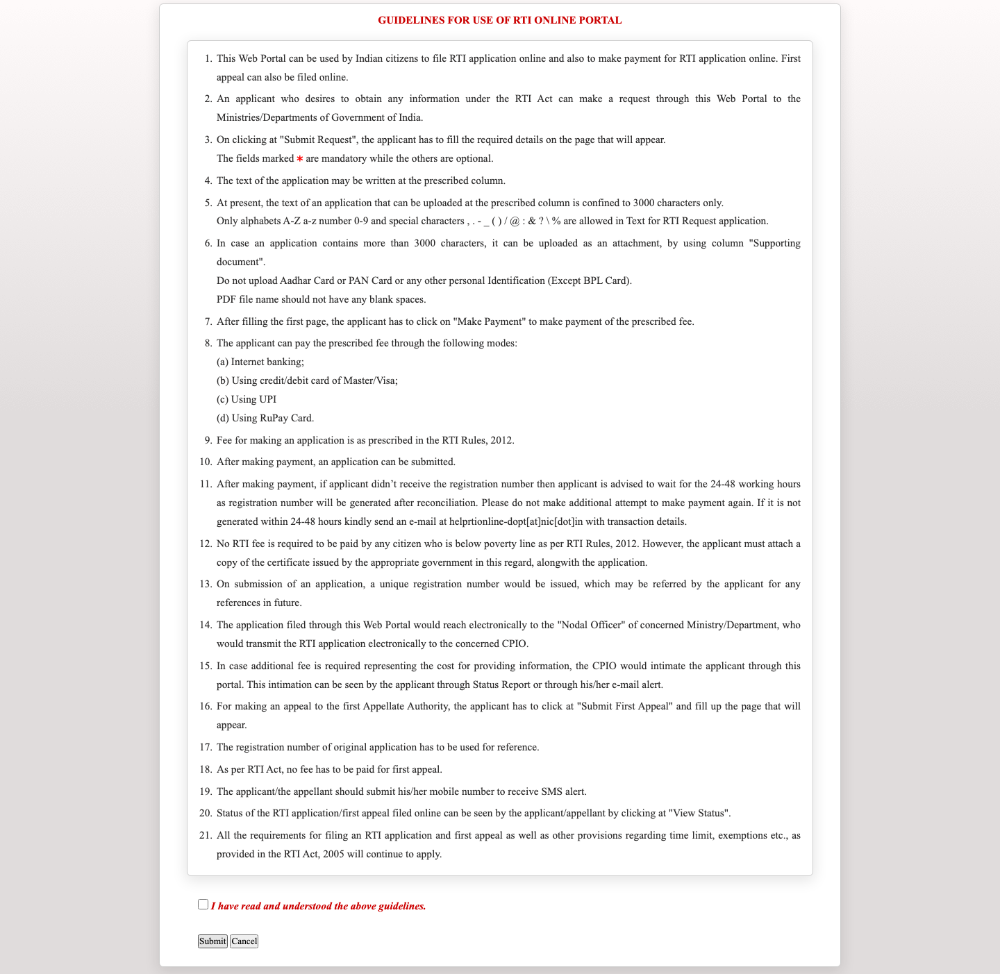
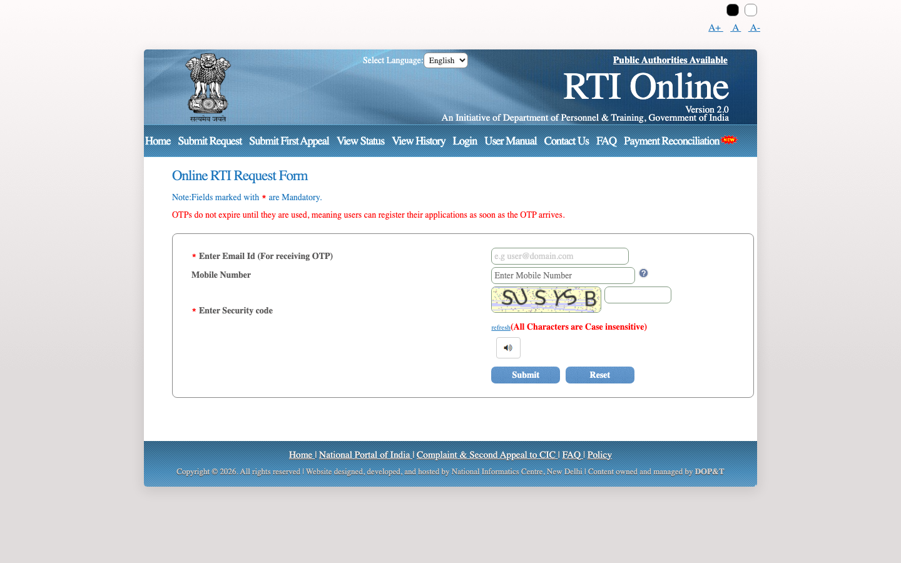
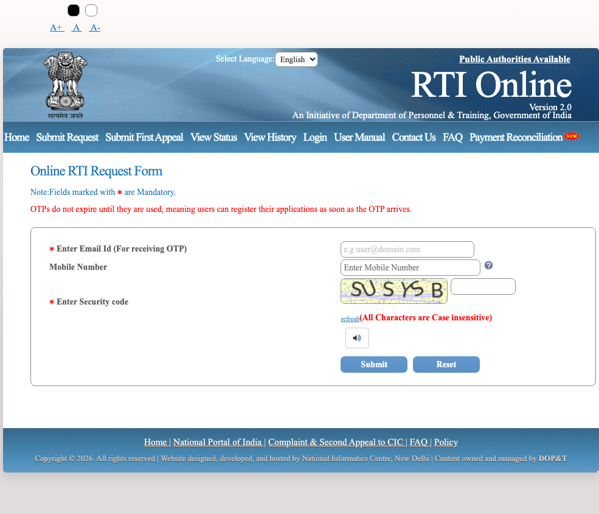
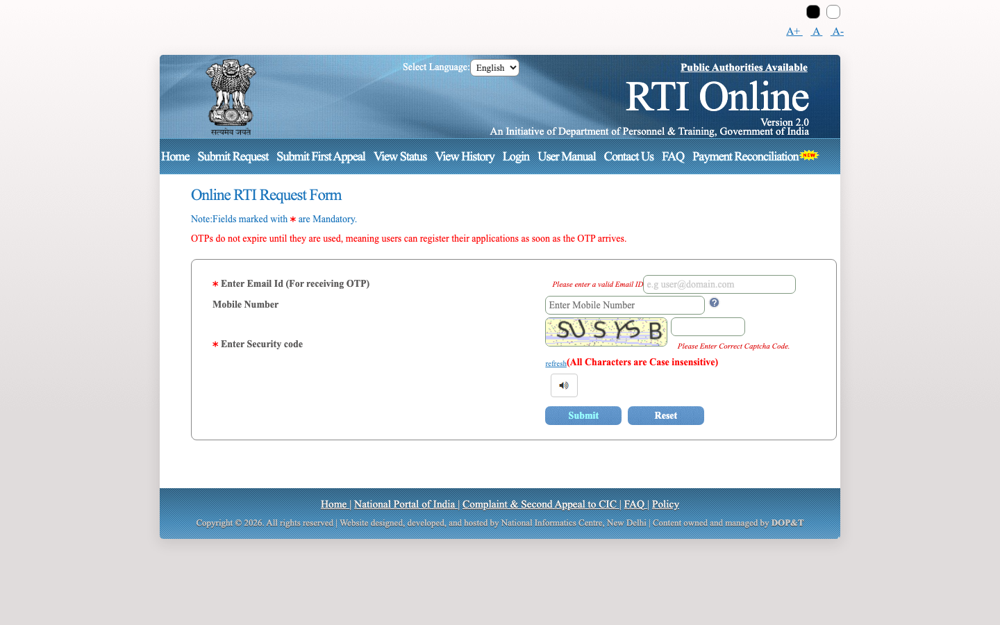
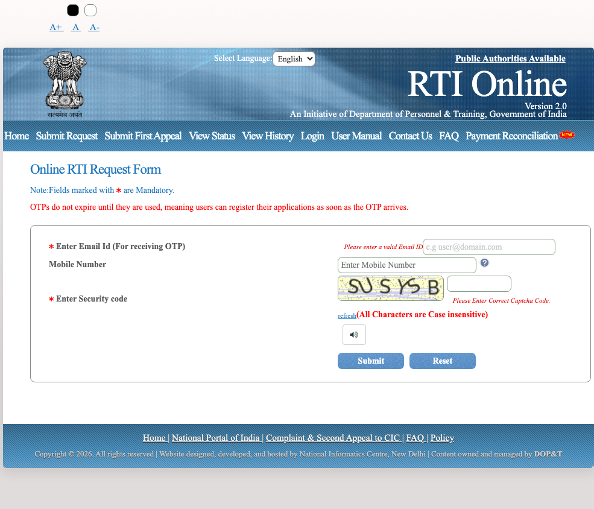
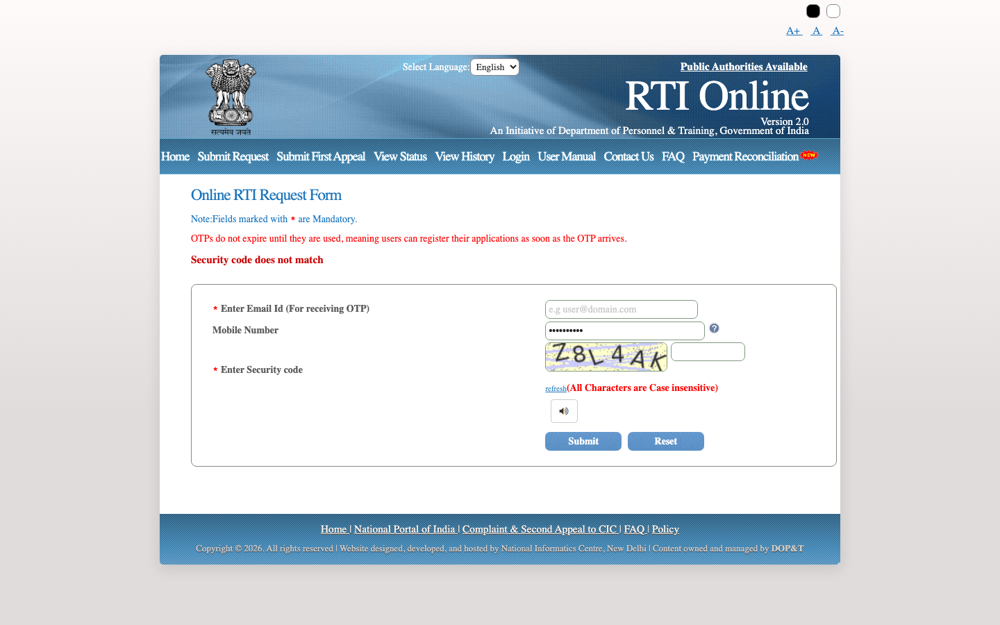
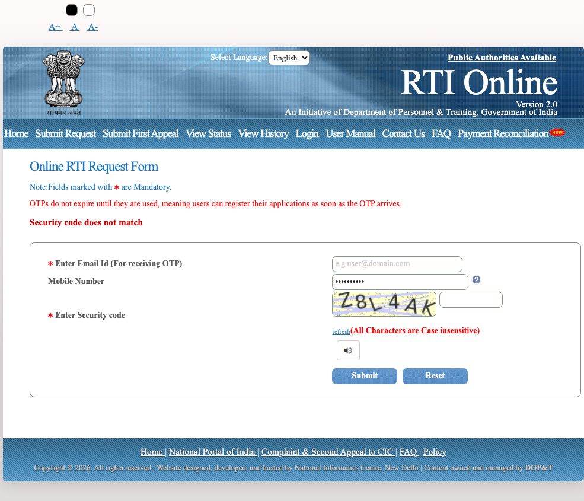

# Flow: submit-request

| ID | Label | URL | Action in | Next | Validation observed | Screenshot |
| --- | --- | --- | --- | --- | --- | --- |
| `submit-request.guidelines` | VERIFIED_LIVE | https://rtionline.gov.in/guidelines.php?request | Home → Submit Request | Submit; Cancel | — | `screenshots/desktop/submit-request.guidelines.png` |
| `submit-request.guidelines.unchecked` | VERIFIED_LIVE | https://rtionline.gov.in/guidelines.php?request | Submit without accepting guidelines | Submit; Cancel | alert: Please select the undertaking statement! | `screenshots/desktop/submit-request.guidelines.unchecked.png` |
| `submit-request.email-gate` | VERIFIED_LIVE | https://rtionline.gov.in/request/request_email_check.php?pageid=c4ca4238a0b923820dcc509a6f75849b | Accept guidelines and Submit | Submit → OTP (blocked without captcha); Reset | — | `screenshots/desktop/submit-request.email-gate.png` |
| `submit-request.email-gate.empty` | VERIFIED_LIVE | https://rtionline.gov.in/request/request_email_check.php?pageid=c4ca4238a0b923820dcc509a6f75849b | Submit email gate with empty fields | Submit; Reset; Public Authorities Available; Home; Submit Request; Submit First Appeal; View Status; View History; Login; User Manual | Please enter a valid Email ID; Please Enter Correct Captcha Code. | `screenshots/desktop/submit-request.email-gate.empty.png` |
| `submit-request.email-gate.wrong-captcha` | VERIFIED_LIVE | https://rtionline.gov.in/request/request_email_check.php | Submit dummy email + wrong captcha ZZZZZZ | Submit; Reset; Public Authorities Available; Home; Submit Request; Submit First Appeal; View Status; View History; Login; User Manual | Security code does not match | `screenshots/desktop/submit-request.email-gate.wrong-captcha.png` |
| `submit-request.otp` | DOCUMENTED_ONLY | — | Correct captcha + email submit; OTP mailed/SMS | Submit OTP → request form | — | — |
| `submit-request.form` | DOCUMENTED_ONLY | — | Valid OTP | Select ministry/authority; Fill applicant details; BPL Yes → submit; BPL No → Make Payment | — | — |
| `submit-request.form.bpl-yes` | DOCUMENTED_ONLY | — | BPL = Yes | Upload BPL PDF; Submit (no payment) | — | — |
| `submit-request.form.bpl-no` | DOCUMENTED_ONLY | — | BPL = No | Make Payment | — | — |
| `submit-request.payment-form` | DOCUMENTED_ONLY | — | Make Payment | Select Payment Gateway radio; Pay; Back | — | — |
| `submit-request.sbi-gateway` | DOCUMENTED_ONLY | — | Pay | Net banking / cards / UPI; CANCEL | — | — |
| `submit-request.payment-success` | DOCUMENTED_ONLY | — | Successful gateway payment | Save; Print; Print Application | — | — |
| `submit-request.payment-failure` | DOCUMENTED_ONLY | — | Gateway decline / timeout / UPI not completed | Payment Reconciliation; Do not pay again | — | — |
| `submit-request.payment-cancel` | DOCUMENTED_ONLY | — | CANCEL on SBI page | Return to portal; Payment Reconciliation if debited | — | — |
| `submit-request.acknowledgement` | DOCUMENTED_ONLY | — | Redirect after payment or BPL submit | Save; Print; Print Application; View Status | — | — |

## submit-request.guidelines

## submit-request.guidelines.unchecked

Validation observed: alert: Please select the undertaking statement!

## submit-request.email-gate

## submit-request.email-gate.empty

Validation observed: Please enter a valid Email ID; Please Enter Correct Captcha Code.

## submit-request.email-gate.wrong-captcha

Validation observed: Security code does not match

