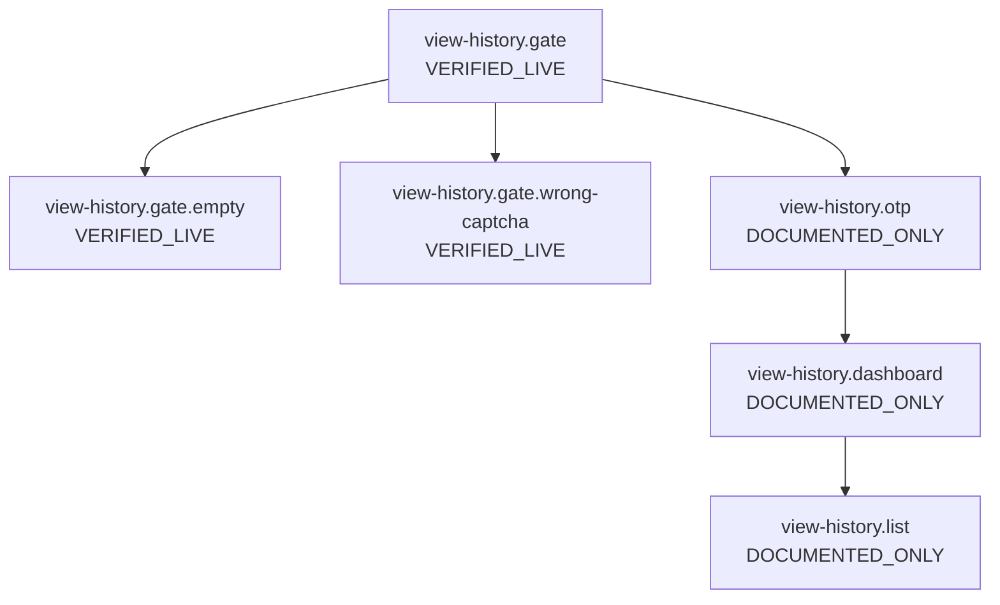
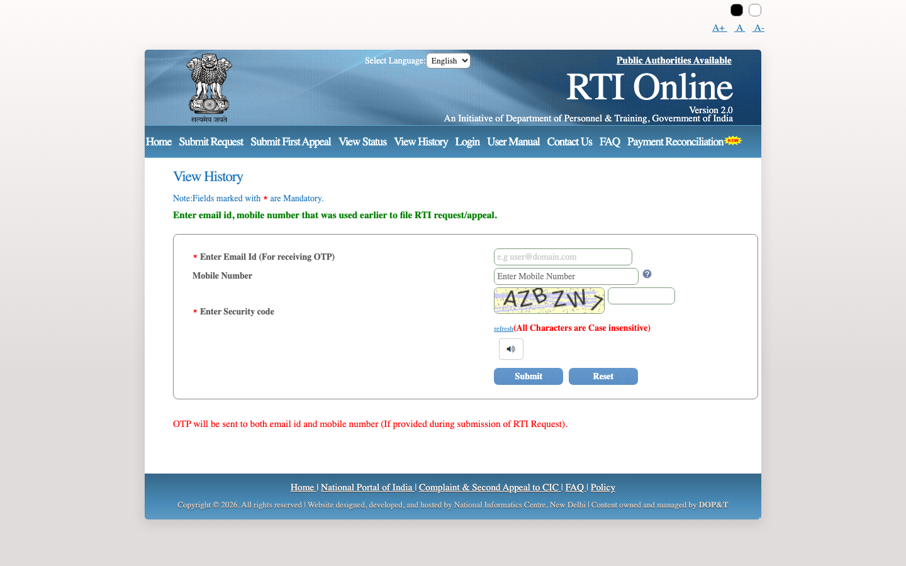
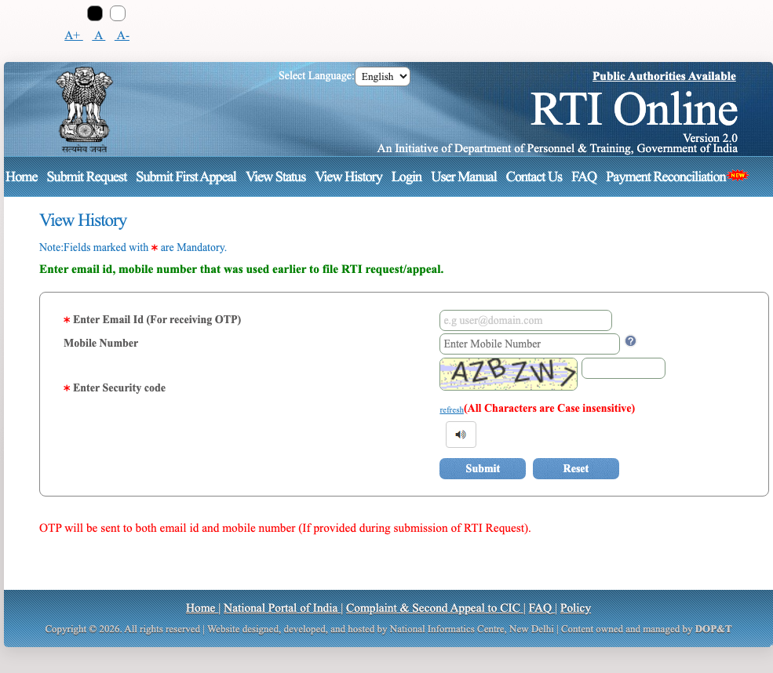
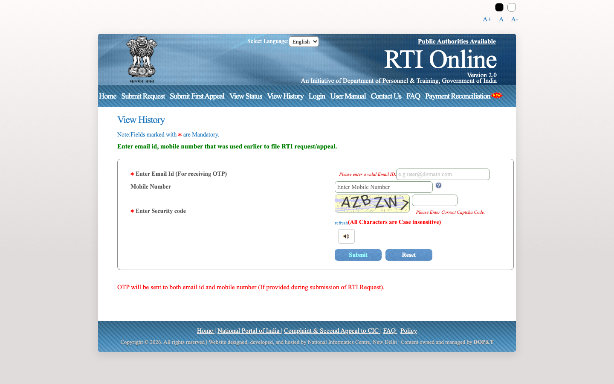
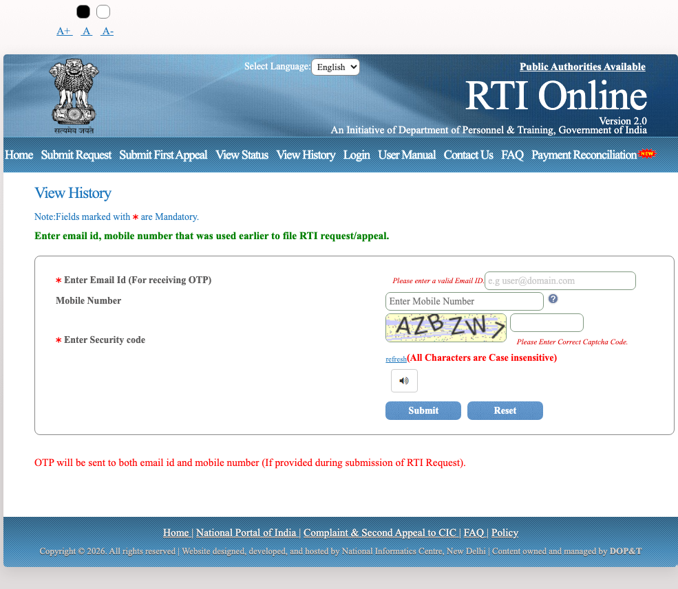
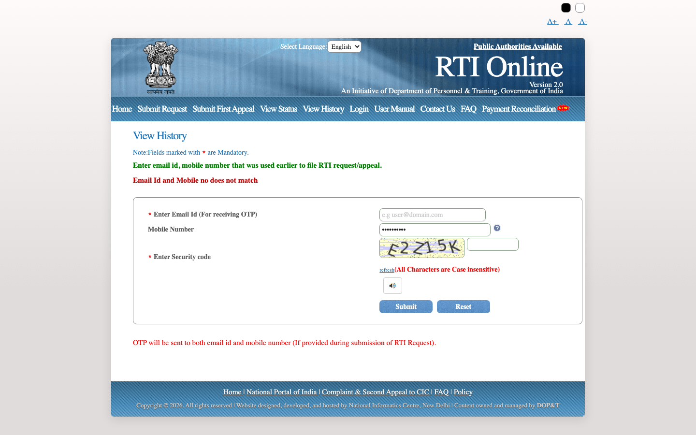
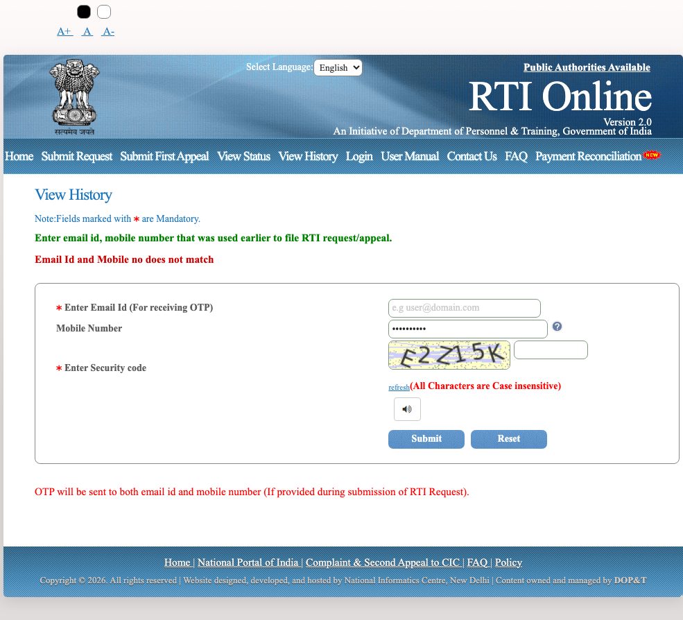

# Flow: view-history

| ID | Label | URL | Action in | Next | Screenshot |
| --- | --- | --- | --- | --- | --- |
| `view-history.gate` | VERIFIED_LIVE | https://rtionline.gov.in/request/status_history.php | Home → View History | Submit; Reset; Public Authorities Available; Home; Submit Request; Submit First Appeal; View Status; View History; Login; User Manual | `screenshots/desktop/view-history.gate.png` |
| `view-history.gate.empty` | VERIFIED_LIVE | https://rtionline.gov.in/request/status_history.php | Submit empty history form | Submit; Reset; Public Authorities Available; Home; Submit Request; Submit First Appeal; View Status; View History; Login; User Manual | `screenshots/desktop/view-history.gate.empty.png` |
| `view-history.gate.wrong-captcha` | VERIFIED_LIVE | https://rtionline.gov.in/request/status_history.php | Dummy email + wrong captcha | Submit; Reset; Public Authorities Available; Home; Submit Request; Submit First Appeal; View Status; View History; Login; User Manual | `screenshots/desktop/view-history.gate.wrong-captcha.png` |
| `view-history.otp` | DOCUMENTED_ONLY | — | Valid email + mobile + captcha | Submit OTP → dashboard | — |
| `view-history.dashboard` | DOCUMENTED_ONLY | — | Valid OTP | Open Registered / Pending / Disposed Requests or Appeals | — |
| `view-history.list` | DOCUMENTED_ONLY | — | Click Registered Requests | Open a registration number; Search; Next page | — |

## view-history.gate

## view-history.gate.empty

## view-history.gate.wrong-captcha

