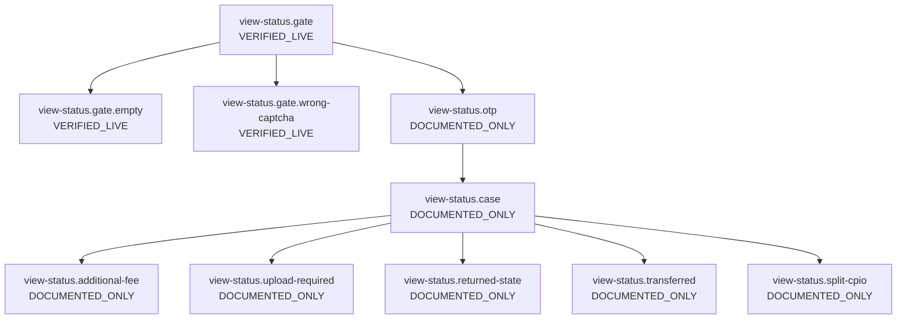
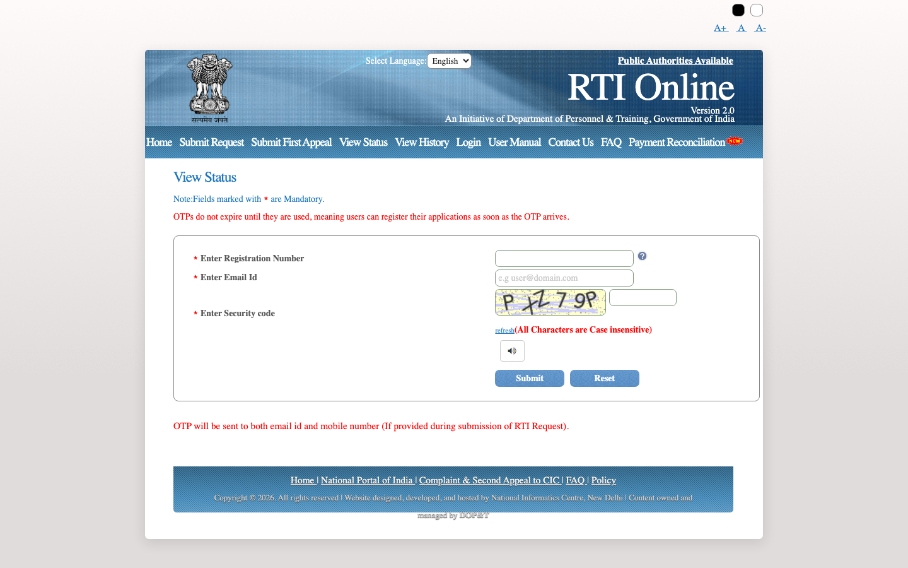
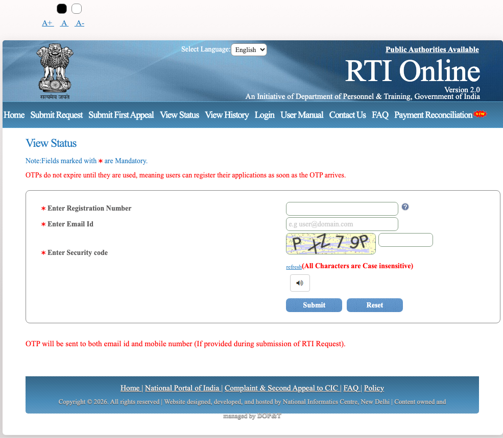
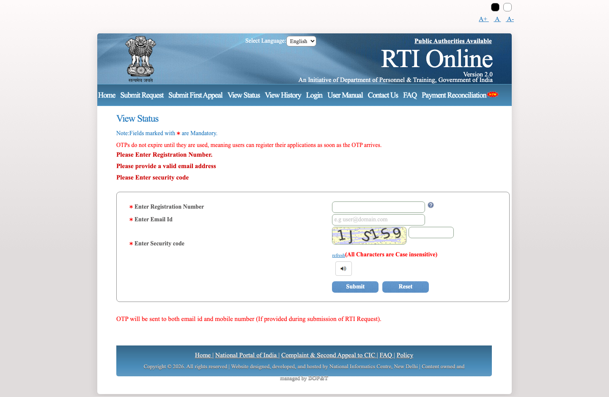
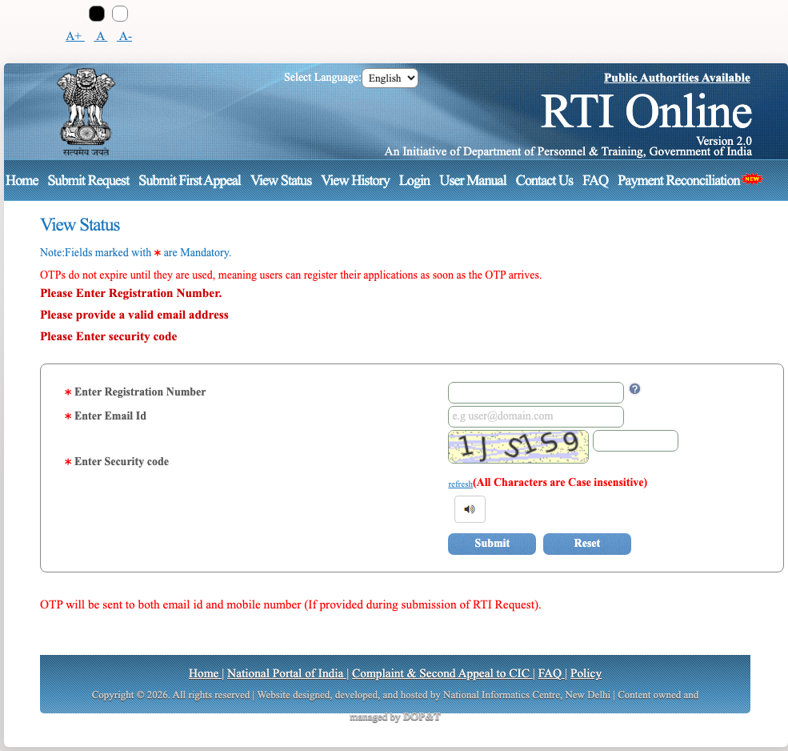
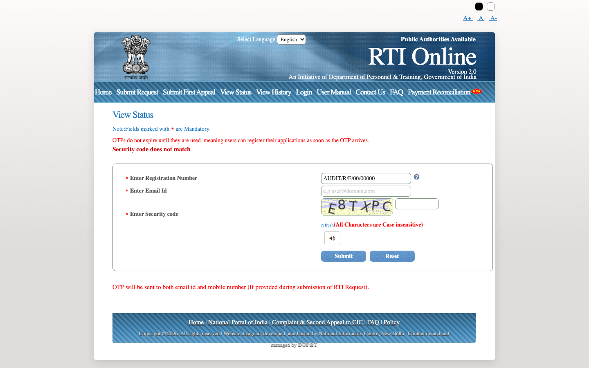
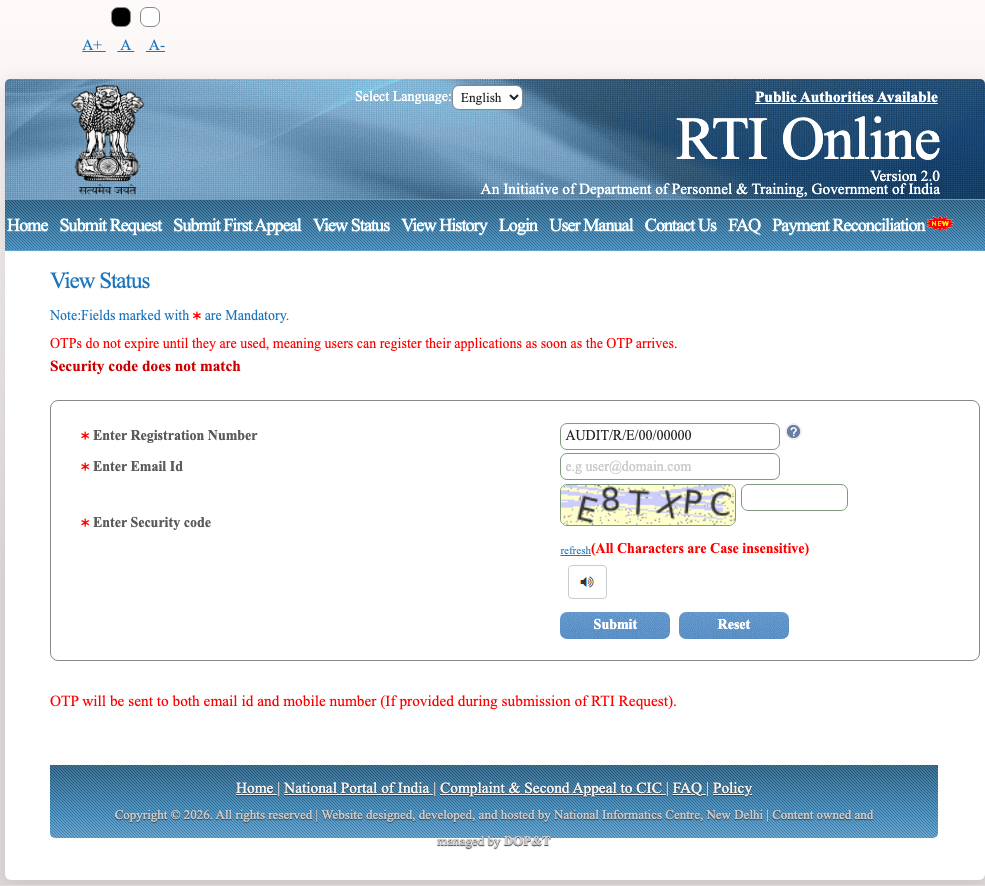

# Flow: view-status

| ID | Label | URL | Action in | Next | Validation observed | Screenshot |
| --- | --- | --- | --- | --- | --- | --- |
| `view-status.gate` | VERIFIED_LIVE | https://rtionline.gov.in/request/status.php | Home → View Status | Submit; Reset; Public Authorities Available; Home; Submit Request; Submit First Appeal; View Status; View History; Login; User Manual | — | `screenshots/desktop/view-status.gate.png` |
| `view-status.gate.empty` | VERIFIED_LIVE | https://rtionline.gov.in/request/status.php | Submit empty status form | Submit; Reset; Public Authorities Available; Home; Submit Request; Submit First Appeal; View Status; View History; Login; User Manual | Please Enter Registration Number.; Please provide a valid email address; Please Enter security code | `screenshots/desktop/view-status.gate.empty.png` |
| `view-status.gate.wrong-captcha` | VERIFIED_LIVE | https://rtionline.gov.in/request/status.php | Dummy registration + wrong captcha | Submit; Reset; Public Authorities Available; Home; Submit Request; Submit First Appeal; View Status; View History; Login; User Manual | Security code does not match | `screenshots/desktop/view-status.gate.wrong-captcha.png` |
| `view-status.otp` | DOCUMENTED_ONLY | — | Valid registration + email + captcha | Submit OTP → case card | — | — |
| `view-status.case` | DOCUMENTED_ONLY | — | Valid OTP | Print RTI Application; Print Status; Go Back | — | — |
| `view-status.additional-fee` | DOCUMENTED_ONLY | — | CPIO requests extra fee | Make Payment → payment form / SBI | — | — |
| `view-status.upload-required` | DOCUMENTED_ONLY | — | CPIO cannot open original attachment | Choose File; Attached | — | — |
| `view-status.returned-state` | DOCUMENTED_ONLY | — | Filed against a State public authority | Go Back | — | — |
| `view-status.transferred` | DOCUMENTED_ONLY | — | Section 6(3) transfer | Open new registration number in View Status | — | — |
| `view-status.split-cpio` | DOCUMENTED_ONLY | — | Nodal officer splits the request | Click here to view details; Appeal against a child number | — | — |

## view-status.gate

## view-status.gate.empty

Validation observed: Please Enter Registration Number.; Please provide a valid email address; Please Enter security code

## view-status.gate.wrong-captcha

Validation observed: Security code does not match

